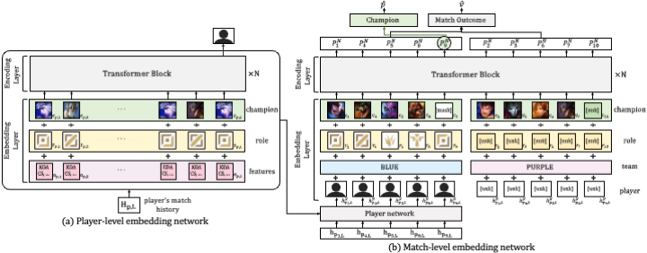
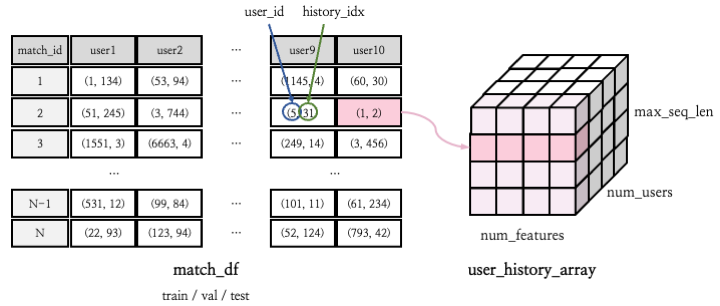

## DraftRec: Personalized Draft Recommendation for Winning in Multi-Player Online Battle Arena Game (WWW' 2022): Official Project Webpage
This repository provides the official PyTorch implementation of the corresponding paper: 
[DraftRec](https://arxiv.org/abs/2204.12750)

> Authors: Hojoon Lee*, Dongyoon Hwang*, Hyunseung Kim, Byungkun Lee, and Jaegul Choo,<br>
> Affiliation: KAIST AI




> **Abstract:** 
This paper presents a personalized character recommendation system for Multiplayer Online Battle Arena (MOBA) games which are considered as one of the most popular online video game genres around the world. 
When playing MOBA games, players go through a *draft* stage, where they alternately select a virtual character to play. 
When drafting, players select characters by not only considering their character preferences, but also the synergy and competence of their team's character combination. 
However, the complexity of drafting induces difficulties for beginners to choose the appropriate characters based on the characters of their team while considering their own champion preferences.
To alleviate this problem, we propose DraftRec, a novel hierarchical model which recommends characters by considering each player's champion preferences and the interaction between the players.
DraftRec consists of two networks: the player network and the match network. 
The player network captures the individual player's champion preference, and the match network integrates the complex relationship between the players and their respective champions. 
We train and evaluate our model from a manually collected 280,000 matches of *League of Legends* and a publicly available 50,000 matches of *Dota2*. 
Empirically, our method achieved state-of-the-art performance in character recommendation and match outcome prediction task. 
Furthermore, a comprehensive user survey confirms that DraftRec provides convincing and satisfying recommendations.

## Dataset

[user_history_data (~16gb)](https://drive.google.com/file/d/1km--Hmawldbi5mrw6dGeXzJQPttfXJTE/view?usp=sharing)



Here we provide a detailed description about our manually constructed League of Legends dataset, which was collected by utilizing the publicly accessible API endpoint provided by Riot Games (https://developer.riotgames.com/). Our League of Legends dataset is composed of 279,893 top 0.1% ranked players' matches. In order to guarantee the quality of our dataset, we strictly restricted the tier (i.e., rank) of the players to Challenger, GrandMaster, Master, Diamond-1, and Diamond-2 ranked players. 

Our dataset is mainly divided into two files : the **match dataset** (e.g., train.csv, val.csv, test.csv) and the **user history dataset** (e.g., user history array). The match dataset contains information regarding the userID and the match history index respective to the user's personal match history. The user history dataset contains detailed information about each user's past matches. 
* **Match dataset**: Each row in the match dataset (i.e., match_id) indicates a separate match in the dataset. Each column in the match dataset (i.e., user1, user2, ..., user10) is listed according to the champion selection order. For example, user1 indicates the 1st user who selects a champion and user9 indicates the 9th user who selects a champion. Furthermore, each column includes the (i) user_id information and the (ii) history_index information. 
  * (i) user_id : Information about which user has participated in that particular match. 
  * (ii) history_index : Information about the respective match history index respective to the user's personal match history. 
  * Example : As shown in the figure above, for match_id =2 , the user_id and his/her respective match history index for user9 (the 9th user who selects a champion in the match) is (5,31). Thus, the 9th user who selected a champion in match_id =2 has user_id=5 and match_id=2 is recorded as the 31st match within user_id=5's match history. 
* **User history data** : The user history data contains detailed information regarding each match within the user's personal match history. It includes information about the champion selected by the user, designated role and team, banned champions in the match, information about whether the user won or lost the match, and specific personal match performance statistics (e.g., total gold earned, total damage, etc). 
  * Data structure : The user_history_array is formed as a tensor with shape (number of users) x (number of features) x (max user history length). There are a total of 62,466 users, 57 different type of features (detailed information regarding the semantic of the features can be found in /data/lol/categorical_ids.json), and the max user history length is 1145.

More detailed descriptions considering the dataset statistics are provided in [EDA.ipynb](https://github.com/dojeon-ai/DraftRec/blob/master/data/lol/EDA.ipynb).

## Model checkpoints for the trained models

The pre-trained models can be found below. 

|                             Model checkpoint                             |      ACC        |     HR@10    | 
|--------------------------------------------------------------------------|-----------------|--------------
|[DraftRec (hidden_dim=64, seq_len=10)](https://drive.google.com/drive/folders/1kEOss__o-DhSHX6y3hVz5kFkjhVpb9tT?usp=sharing)                             |      54.6       |     88.0     |
|[DraftRec (hidden_dim=64, seq_len=50)](https://drive.google.com/drive/folders/1yR81p_nSLZQ-PTBsHgdUufEjIMjVFUm4?usp=sharing)                            |      55.2       |     89.9     |
|[DraftRec (hidden_dim=128, seq_len=10)](https://drive.google.com/drive/folders/1h_T7AhtYFiKkwOA6u5-c1MlNgp3vx6tv?usp=sharing)                            |      54.8       |     88.7     |
|[DraftRec (hidden_dim=128, seq_len=50)](https://drive.google.com/drive/folders/1WZc9hGi7Mhp2m83g3cFELv1ePp67moX6?usp=sharing)                            |      55.0       |     89.8     |

After investigating through the dataset to publish our code, we found that several matches within the dataset were preprocessed incorrectly. 
Thus, we discovered a minor decreasement in accuracy and a minor increasement in HR@10 compared to the results of our paper.

## Environment setup

Our code can run on a *single* GPU or on *multi*-GPUs.
See requirements.txt for all prerequisites, and you can also install them using the following command.

```
pip install -r requirements.txt
```

## Training

To train the draftrec model with a *single* GPU, try the following command:

```
python main.py --template draftrec --dataset_path [DATASET_PATH]
```

To train the draftrec model with *multiple* GPUs, try the following command:

```
python main.py --template draftrec --dataset_path [DATASET_PATH] --use_parallel true
```

## Cite

```
@article{lee2022draftrec,
  title={DraftRec: Personalized Draft Recommendation for Winning in Multi-Player Online Battle Arena Games},
  author={Hojoon Lee and Dongyoon Hwang and Hyunseung Kim and Byungkun Lee and Jaegul Choo},
  booktitle = {Proceedings of the Web Conference 2022},
  series = {WWW '22},
  year={2022}
}
```

## Disclaimer

This is not an official Riot Games product.
